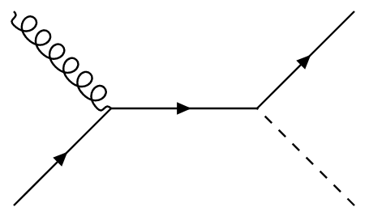
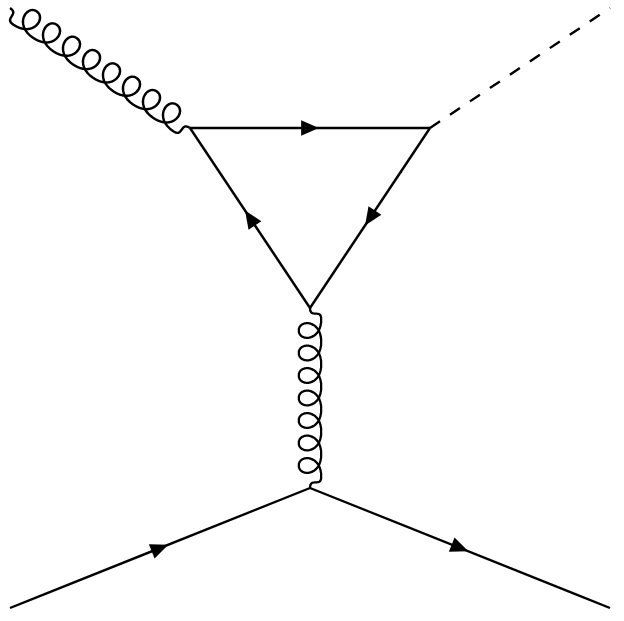

# Challenges

## Yukawa couplings of light quarks

By default, the Yukawa couplings of the light quarks (uds) are set to zero in the `loop_sm` model. In fact, I believe that no couplings between the Higgs boson and the light quarks are coded into the model. However, since the light couplings differ only from the heavy couplings in their strength, one could easily copy the code that is already present for the heavy quark Higgs boson vertex.

## Definition of the process

What exactly do we want to generate when we say "Higgs plus jet at NLO"? In MadGraph, you can easily define the leading-order signal using the following command:
```shell
MG5_aMC> generate p p > h c
```
In the Standard Model, only two tree-level diagrams contribute to this process:

{: style="height:25%;width:25%"}
{: style="height:30%;width:30%;"}

And these are precisely the diagrams which are generated by MadGraph. Even though these are the tree-level diagrams, they are still drowned by the dominant next-to-leading order diagram featuring a Higgs-gluon-gluon coupling:

{: style="height:50%;width:50%;"}
