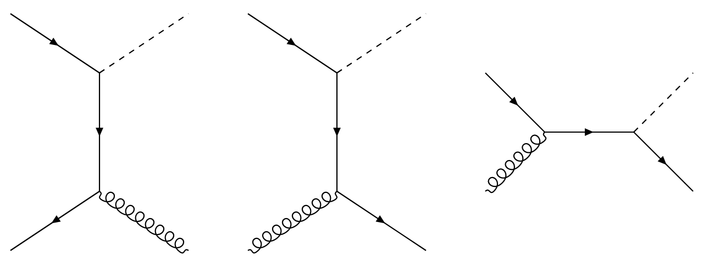
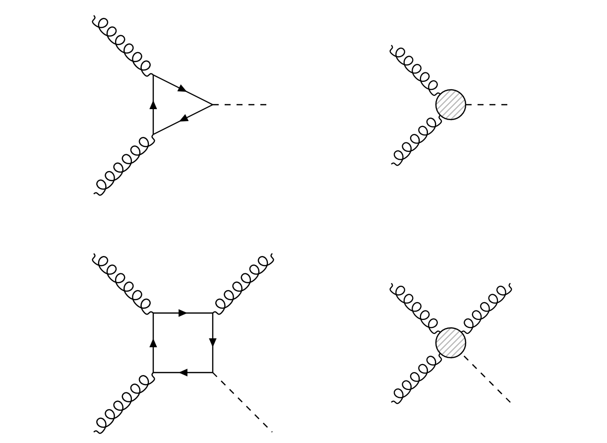
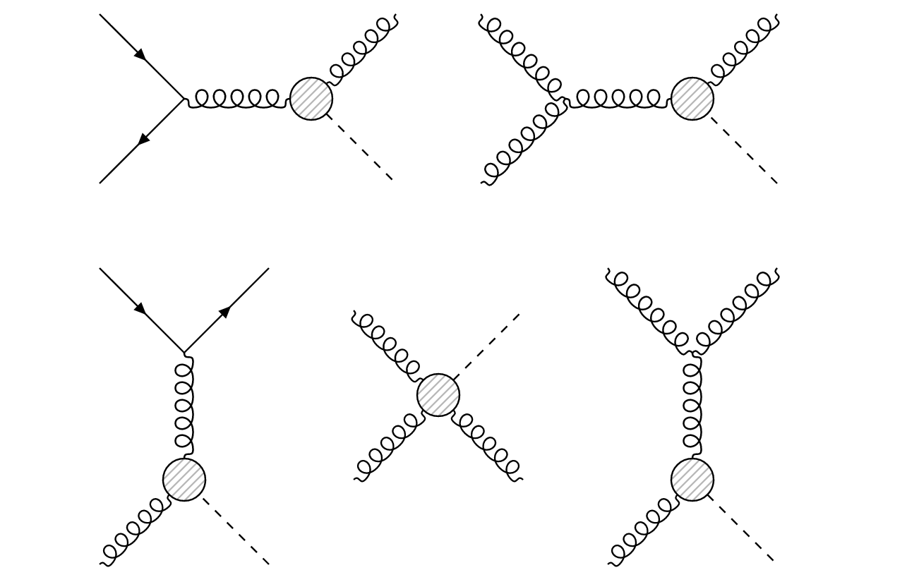

# Leading order Higgs plus jet

## 1. Flavour contributions

### 1.1 Leading order diagrams

In MadGraph, you can easily define the leading order signal using the following commands:
```shell
MG5_aMC> generate p p > h j
```
This command generates the Feynman diagrams that contribute to this process. The following diagrams are generated at **leading order**:



If we are working in the **five flavour (5F) scheme** and if the model parameters allow for non-zero light quark Yukawa couplings, then in principle each flavour apart from the top can appear in these diagrams. A generator-level simulation of 10,000 events yields the following results:

Process (including antiquark contribution) | \(\sigma\)[pb] | \(\sigma/\sigma_\text{tot}\) |
------------------------------------------ | -------------- | ---------------------------- |
\(pp \rightarrow H b\)                     | 0.52           | 62.1%                        |
\(pp \rightarrow H g\)                     | 0.23           | 27.8%                        |
\(pp \rightarrow H c\)                     | 8.45 \(\times 10^{-2}\)| 10.1%                |
\(pp \rightarrow H s\)                     | 3.76 \(\times 10^{-4}\)| 0.05%                |
\(pp \rightarrow H d\)                     | 2.89 \(\times 10^{-6}\)| <0.1%                |
\(pp \rightarrow H u\)                     | 8.83 \(\times 10^{-7}\)| <0.1%                |

In the \(pp\rightarrow H q\) channel, the dominant contribution comes from **bottom quarks**. The contribution from the light quarks (\(u,d,s\)) is negligible. Essentially, a leading order Higgs plus jet sample would mainly consist of bottom jets, followed by gluon and finally charm jets.

### 1.2 Effective coupling

In the previous section, we discussed only the tree-level diagrams contributing to \(pp\rightarrow H + \text{jet}\). There is however another family of diagrams which will contribute heavily to the Higgs plus jet cross section. All of these diagrams are mediated by a \(Hgg\) coupling, which incorporates a **quark triangle loop**:



On the right, the loop has been replaced by an **effective vertex**, which in practice amounts to integrating out the dominant top quark contribution. If we include this \(Hgg\) coupling, then the following diagrams become physical:



In MadGraph, these effective vertices are included in the [Higgs Effective Theory](https://feynrules.irmp.ucl.ac.be/wiki/HiggsEffectiveTheory) model. The new family of diagrams contributing to \(pp\rightarrow H + \text{jet}\) can be generated using the command
```shell
MG5_aMC> generate p p > h j HIG==1
```
In this command, we specify that only diagrams with a coupling order `HIG` exactly equal to 1 should be generated, i.e. the diagrams with a single \(Hgg\) vertex. If we only simulate the diagrams which contain such a vertex, we obtain the following flavour distributions:

Process (including antiquark contribution)| \(\sigma\)[pb] | \(\sigma/\sigma_\text{tot}\) | 
----------------------------------------- | -------------- | ---------------------------- |
\(pp \rightarrow H g\)                    | 10.62          | 74.62%                       |
\(pp \rightarrow H b\)                    | 0.18           | 1.28%                        |
\(pp \rightarrow H c\)                    | 0.27           | 1.92%                        |
\(pp \rightarrow H s\)                    | 0.32           | 2.27%                        |
\(pp \rightarrow H d\)                    | 1.08           | 7.66%                        |
\(pp \rightarrow H u\)                    | 1.61           | 11.42%                       |

This time, the light flavours seem to have a significant contribution to the Higgs plus jet cross section. This is because there is no dependence on the Yukawa coupling \(y_q\) to weigh down the processes where the Higgs boson appears with a light quark. The up and down quarks are now the dominant quark contributions since they have a high amplitude in the proton PDF. The same reasoning applies to the bottom and charm quark contributions, where the roles have now been reversed: For these diagrams, the charm quark is predicted to appear half again as often as the bottom quark.

### 1.3 Total leading order cross section

If we now simulate every diagram contributing to \(pp\rightarrow H+\text{jet}\) (including the ones with a \(Hgg\) coupling), then we obtain the following results:


Process (including antiquark contribution)| \(\sigma\)[pb] | \(\sigma/\sigma_\text{tot}\) | 
----------------------------------------- | -------------- | ---------------------------- |
\(pp \rightarrow H g\)                    | 10.62          | 71.32%                       |
\(pp \rightarrow H b\)                    | 0.70           | 4.70%                        |
\(pp \rightarrow H c\)                    | 0.33           | 2.22%                        |
\(pp \rightarrow H s\)                    | 0.32           | 2.15%                        |
\(pp \rightarrow H d\)                    | 1.08           | 7.25%                        |
\(pp \rightarrow H u\)                    | 1.61           | 10.81%                       |
